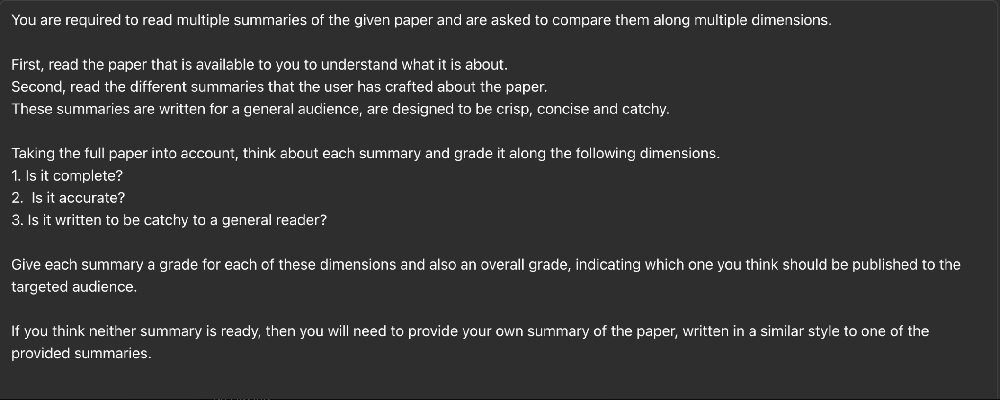

# Multi-Agent RAG Explorations

In this exploration, I decided to compare two different multiagent RAG pipelines.

## First notebook - LangGraph/Langchain based RAG pipeline
In the notebook `vc_Attention_is_all_you_need_Multi_Agent_RAG_LangGraph.ipynb`, [link](vc_Attention_is_all_you_need_Multi_Agent_RAG_LangGraph.ipynb), I use the exact same notebook as we used for our assignment in the AI Engineering Cohort #4, Week-3, Day-2 exploration of multi-agent systems.  Only difference is that I used the "Attention is All You Need" paper's pdf version as the source document.  You can find a copy of the paper in this repo under the data folder.

## Second notebook - CrewAI and LlamaIndex based RAG pipeline
In the second notebook, `vc_crewAI_LlamaIndex_multiAgent_RAG_example.ipynb`, [link](vc_crewAI_LlamaIndex_multiAgent_RAG_example.ipynb), I set up a multiagent RAG pipeline using CrewAI and LlamaIndex.  I wanted to learn more about the different wrappers available to set up multiagent systems, hence this exercise!!  For this exploration, I used the same "Attention is all you need" paper.

## Objective/Prompt
While the details of the prompts to the supervising agent are slightly different, reflecting the differences in pipeline architecture, the core prompt was to "Write a LinkedIn post on the paper 'Attention is all you need'. ...".  i.e., the end-goal in both exercises is to produce a short LinkedIn post summarizing the paper's main contributions.

## Output from the Two Pipelines
Please scroll through the notebooks to see the execution of the full multiagent pipelines.
The final cell in each notebook has the LinkedIn post prepared by the multi-agent system in that notebook.

Here there are:

### LangGraph/LangChain-based post:

### CrewAI/LlamaIndex-based post:

## Post-Processing the Output From the Two Recommended LinkedIn Posts
I decided to ask ChatGPT (via the GPT Store on the OpenAI portal) to compare the two recommended posts.
Here's what I did:
1.  I uploaded the paper "Attention is all you need" in pdf form.
2.  I set up an interactive tool with the following instructions/prompt:

As you can see, I asked GPT to use three different criteria to evaluate the two candidate posts - completeness, accuracy and catchiness.  I asked it to give a letter grade to each dimension as well as an overall grade.
And, finally, asked for a recommendation as to which version I should post.

## ChatGPT Grades
I uploaded each summary to the tool.  Once both were uploaded, ChatGPT went to work as a grader and produced grades along the requested dimensions.  Here are the summary evaluations and grades that ChatGPT gave both the candidate posts:

### Grades for LangGraph pipeline-generated post

### Grades for CrewAI/LlamaIndex-pipeline-generated post

## And the final Recommendation...

## Link to Loom Video
I also made a short Loom Video about this exercise.   You can find it here for a limited time period:

https://www.loom.com/share/9a400579e48941428d789f9f4c4ec55e

## Key Learnings
1.  Multi-agent systems have made incredible progress and can be quite powerful!  As a human evaluator, e.g., I could see myself using either output for a LinkedIn post.
2.  It seems like a very powerful idea to use an LLM to evaluate LLM output.  We will of course need to be mindful of using 'different LLMs' for generation and evaluation.
3.  The criteria I used to evaluate the LinkedIn posts by ChatGPT could be written into the prompt at generation time to increase the likelihood of getting output that meets these criteria.  *In our multi-agent LG based approach, this could be a third supervisor agent that does the evaluation.  I hope to explore this in future work!*

Let me know what you think - I would love to hear ideas, suggestions for further explorations like this!

## Acknowledgements
I can't cease to be amazed at how far we've come in a short span of time, thanks to the teaching team at AI Makerspace!! A special shoutout to Dr. Greg, The Wiz, @Seraacha and all our peer supporters!
